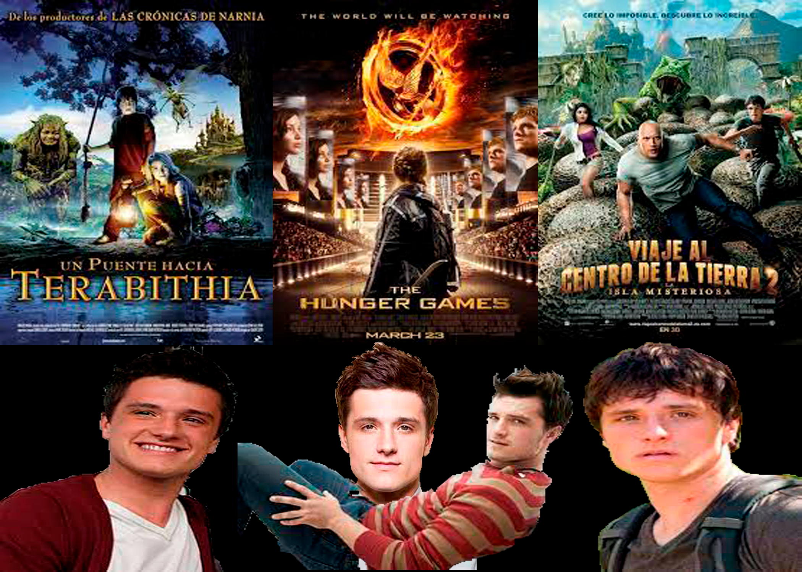
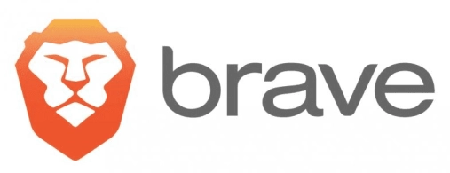
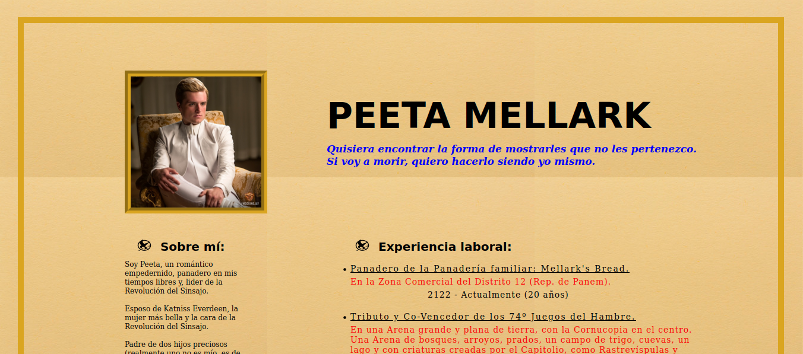
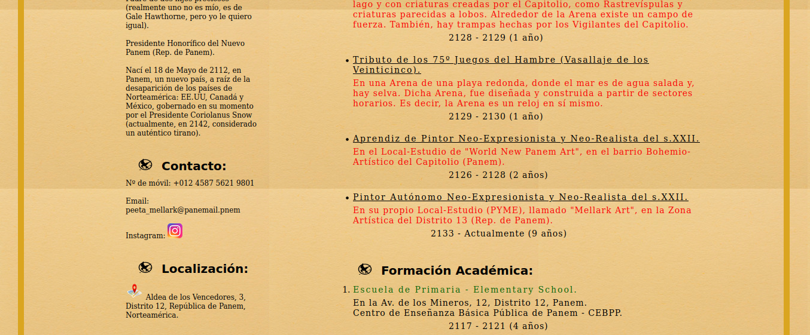
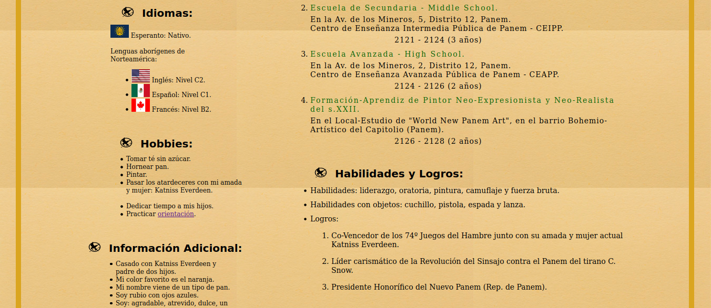
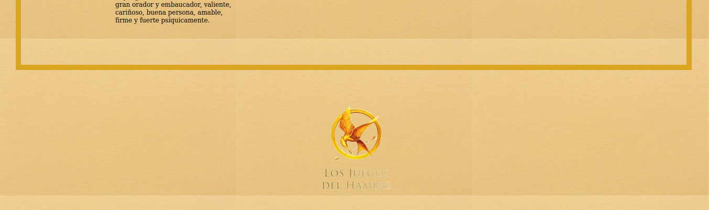

 # Práctica 1: CV de un personaje ficticio.

 ### **Especificaciones de la práctica.**
 
 La Práctica 1 consiste en hacer un CV de un personaje de ficción, de una persona pública real, o tu propio CV. En mi caso, lo he hecho del personaje ficticio "Peeta Mellark" de la saga de "Los Juegos del Hambre", ya que me encanta esta saga y es de mis favoritas. Peeta Mellark es interpretado por el actor: Joshua Ryan Hutcherson. Dicho actor, también ha actuado en películas como: "Un Puente hacia Terabithia", o "Viaje al centro de la Tierra 2". Todas ellas, peliculones. A continuación, os dejo un Sketch de imagen, para que veáis quién es dicho actor y en qué tres películas más famosas ha actuado (obviamente ha actuado en más, pero no puedo mencionar todas):
 
 

 
 La hoja de estilos CSS del CV "CV_PeetaMellark.css", está debidamente comentada para entender cada clase e identificador y, el por qué se ha diseñado así.  
 
 
 El archivo .html principal "index.html", usado para ver el CV desde el Navegador, también está debidamente comentado, para entender su código de programación HTML.
 
 
Por último, hay que saber que, si vas a ejecutar el archivo index.html en el navegador, se debe hacer por el Navegador de Firefox en el S.O de Ubuntu-Linux (ya que, el autor ha trabajado en dicho S.O y, dicho navegador). Por tanto, las medidas y la resolución se ajustan a los parámetros de Mozilla Firefox en Ubuntu (en Mozilla Firefox de Windows 10 pro se desajusta mi CV, entre otras cosas, por el tipo de fuente utilizado en Ubuntu, que en Windows 10 pro no reconoce).
 
 
Espero que se tenga en cuenta. Hay muchos navegadores, tipos de pantalla, PCs y, es complicado ajustarse a todos. Para conseguir que saliera perfecto en todos, tendríamos que tener un buen programa de CSS.
 
 
Aparte de esto, si lo quieres ver por el móvil, utiliza el Navegador "Brave" para Android (no creo que en la tienda de Apple lo encuentres).
 
 

 
[Brave](https://brave.com/es/)

 
Brave es un Navegador Web de código abierto, desarrollado por Brave Software. Dicho Navegador está basado en Chromium. Las ventajas que tiene son que: 

1) Posee la capacidad de bloquear de anuncios y, rastreadores en línea, por medio de lo que se denominan "escudos".
2) Es una herramienta ágil diseñada para protegerse de forma inteligente contra el seguimiento.
3) Cuenta con redireccionamiento HTTPS.
4) Debido a que elimina muchos de los scripts e imágenes asociados con los anuncios en la web, los sitios que se ejecutan en Brave se cargan mucho más rápido. Se cargan el doble de rápido en el escritorio y, ocho veces más rápido en el móvil.
5) Controla las Cookies que se envían y se reciben.
6) Entre otras características.

He sacado el tema de Brave, ya que para visualizar mi CV en el móvil, es el mejor Navegador para visualizarlo. En Brave, mi CV está ajustado, sin que algunas líneas se muevan y se desajusten (lo único que si abres mi CV en Brave, no va a haber margen izquierdo, ya que la resolución de pantalla es más pequeña y tampoco le puedes pedir más. Ya mucho hace ajustando cada línea, palabra y objeto perfectamente en el CV), por el mismo motivo que ya he explicado más arriba entre Firefox Ubuntu y Firefox Windows 10 Pro (el motivo de los tipos de fuente y, los marcos de la resolución de pantalla de cada dispositivo).
 
 
Aunque al abrir mi CV en Brave, también puede verse afectado por el formato fuente usado y la resolución, por eso el margen izquierdo no sale y, la experiencia profesional se baja un poco, al igual que el "icono webp" del final. Piensa que es un navegador en un S.O diferente a Ubuntu y Mozilla Firefox. Aun así, para Brave Android está mucho menos afectado, que para Firefox Windows 10 Pro.
 
 
Para finalizar os dejo la imagen de mi CV completo para que veáis que está ajustado perfectamente:
 
 

 
 
Éste es el icono final de mi CV, es un webp, como un gif, va cambiando, como una animación.
 
 

 
 
 
 
Nota: Todas las imágenes puestas, tanto en el Readme, como en el CV de Peeta Mellark (incluidos iconos de redes sociales y ubicación), están editadas por el programa de edición de imágenes Photoshop 2018, que se encuentra en el escritorio Adobe de "My APPs URJC".

 

### MEJORAS:

 

1. Introducción de un favicon o icono en el título de cabecera: "CV Peeta".

2. Introducción de iconos al principio de cada título de cada sección del CV.

3. Encuadrado de todo el CV en un borde dorado y con el suficiente ancho.

4. Fuera del borde, en la parte inferior, poner un archivo gif o webp que vaya cambiando, según el icono de las partes de la trilogía.

5. Dividir el CV en parte derecha e izquierda:
    
        5.1. En la parte derecha se encontrarán los aspectos más de desarrollo propio: Sobre mí, Contacto, Localización, Idiomas, Hobbies e Información Adicional.

        5.2. En la parte derecha se encontrarán los aspectos más de desarrollo profesional: Experiencia Laboral, Formación Académica y Habilidades y Logros.

6. Debajo del título de quién es el CV (Peeta Mellark), he puesto una frase que dice Peeta en los libros y en las película (a ver si averiguas en qué libro y en qué película) y que me ha parecido una buena idea ponerla como pie de título, ya que describe en una sola frase, el personaje de Peeta.

7. Para finalizar, como se puede observar, está todo bien alineado y cuidado.

 

Por cierto, respecto al ZOOM, al mostrar la P1 en el Navegador, déjalo en la configuración por defecto, o estándar, que suele ser 100%.

 

Muchas gracias por su tiempo y atención.

 

Atentamente.

 

El autor del programa: **CV de un personaje ficticio** =es> **Alejandro Fernández Pérez**, alumno de GISAM (URJC).