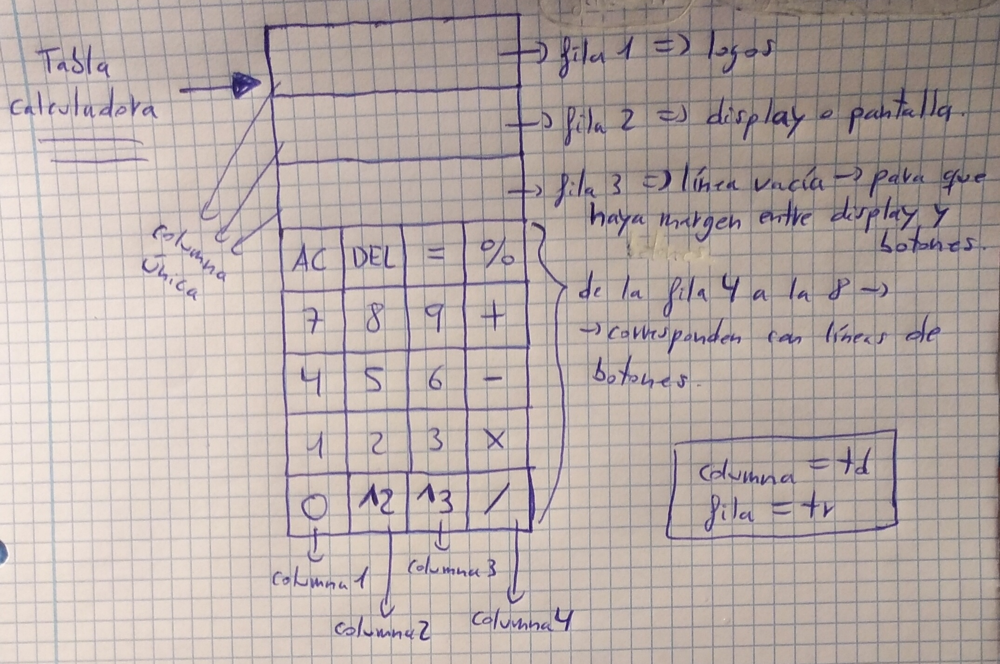
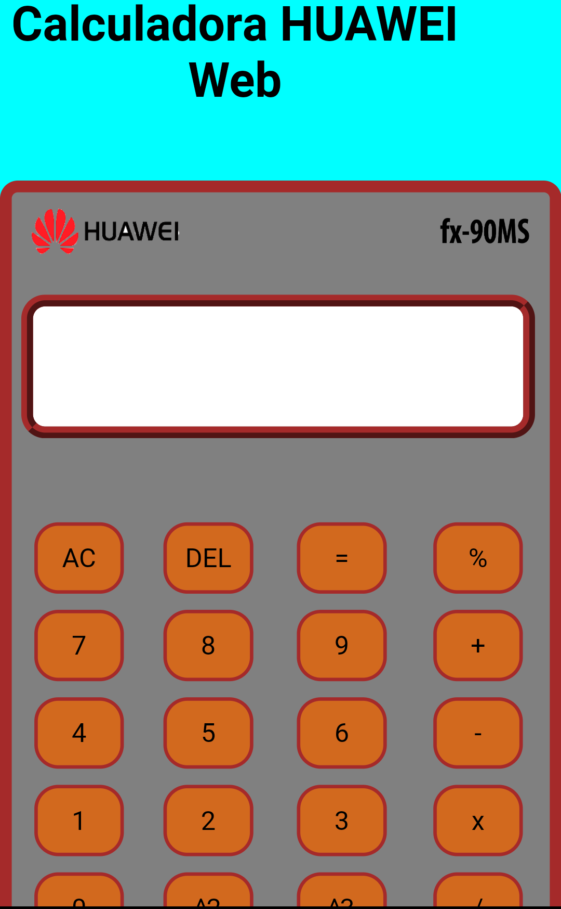
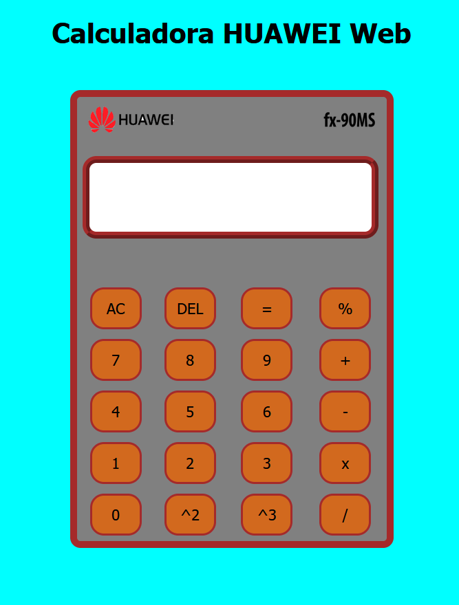
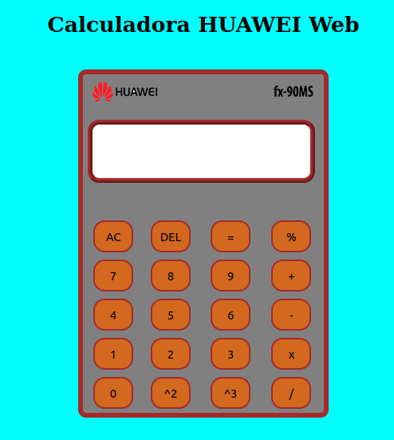
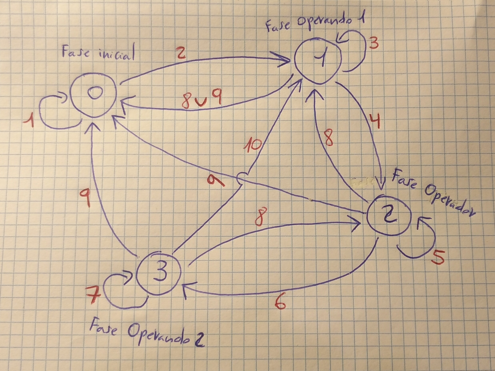

 # Práctica 2: Calculadora Huawei Web.

### **Especificaciones de la práctica.**
 
La práctica 2 consiste en hacer una calculadora web con HTML, como página principal, con CSS, como página de diseño de la calculadora web y, con JS (JavaScript), para programar el código de acción de la calculadora web.
 
 
La calculadora se ha realizado como si fuera una tabla (véase la imagen JPG):   

 
 
La Calculadora Web, se ha decidido que lleve la marca de Huawei, ya que el móvil del autor es Huawei y le gusta dicha marca.
 
 
También se ha incorporado el logo del procesador: fx-90MS.
 
 
La pestaña que se abre para ver la pag HTML, cuenta con:    

    
    Título: Calculator HUAWEI.

    Favicon o icono: Logo HUAWEI en pequeño.    
        

 
 
Respecto al tema de donde visualizar la calculadora a través de este link:
[Calc_Alex](https://a-fernandezp-2016.github.io/2020-2021-CSAAI-Practicas/P2/)

Tenemos que visualizarlo en el Navegador:  

- Mozilla Firefox del Sistema Operativo Ubuntu-LInux.
- Mozilla Firefox del Sistema Operativo Windows 10.
- Brave de dispositivos Android.

Para conseguir su correcta visualización. Obviamente si su PC tiene un tipo de resolución espacial diferente a la mía, se puede descolocar algo, ya que la resolución espacial de las pantallas de un PC y los estilos CSS van de la mano (si cambia uno, el otro puede cambiar). Por otro lado, en Brave para Android, la Calculadora HUAWEI Web se ve perfecta, pero el título se descoloca.

Compruébalo usted mismo en las siguientes imágenes PNG (o a través del link):

**Calculadora en Brave Android:**

**Calculadora en Mozilla Firefox Windows 10:**

**Calculadora en Mozilla Firefox Ubuntu-Linux:**

Una vez visualizado correctamente, se va a explicar cómo se han realizado las acciones JS de la calculadora Huawei web.

Para ello, se ha dividido en dos partes:

1. Parte estándar u obligatoria.
2. Parte de las mejoras.

 

### 1. **Parte Estándar u Obligatoria:**

Las acciones JavaScript de la calculadora, se han realizado siguiendo este "**Mapa de estados de los momentos o fases del proceso al realizar una acción en JS**":

Como se puede apreciar, hay 4 fases o momentos:

1. La fase 0: inicial.
2. La fase 1: operando 1.
3. La fase 2: operador.
4. La fase 3: operando 2.

A continuación, describiremos el proceso que se lleva a cabo en cada uno de los nº de color rojo:

1. No se introduce nada / Se reinicia pulsando la tecla AC y mostrando el 0 en el display o pantalla / Si se pulsa la tecla AC, para quitar el 0, hay que darle a la tecla DEL y, aun así, sigue en la fase inicial o 0. Aunque se puede, también, dejar el 0, ya qué cuando pase a la fase 1, se va a sobreescribir con el nº del botón que se pulse.
2. Se introduce un nº entero (el usuario sólo puede introducir nº enteros pulsando botones, aunque luego la calculadora dé resultados con decimales, que se pueden borrar carácter a carácter, empezando por la derecha).
3. Se introduce otro nº. Se pueden introducir los que sean, formando un nº de n cifras / Se pulsa la tecla DEL para borrar el último carácter, hasta que quede un nº (si se elimina este nº, se pasa a la fase 0) / Si estando en la propia fase 1, se da a la tecla =.
4. Se introduce un operador, tal que: + , - , x , /. No hay más operadores.
5. *PROCESO NO VÁLIDO.*
6. Se introduce un nº entero (esta vez para el Operando 2), donde el usuario sólo puede introducir nº enteros pulsando botones, aunque luego la calculadora dé resultados con decimales, que se pueden borrar carácter a carácter, empezando por la derecha.
7. Se introduce otro nº (esta vez para el Operando 2) y, también, se van contanto los nº que se meten, para almacenarlos en una variable. Se pueden introducir los que sean, formando un nº de n cifras / Se pulsa la tecla DEL para borrar el último carácter y, a su vez, la variable que se ha utilizado para almacenar cuántos nº se han metido en el Operando 2, se va decrementando, en función se pulsa la tecla DEL y se borra carácter a carácter, hasta que dicha variable es igual a 0, en cuyo caso, se pasa a la fase 2.
8. Se pulsa la tecla DEL para borrar el último carácter, con el objetivo de reducir, tantos caracteres como se quiera, como hasta bajar a fases anteriores (incluso hasta la fase inicial).
9. Se reinicia el display o pantalla a 0, mostrando el 0.
10. Una vez tengo la expresión completa de:  
Op1 *operador* OP2 o, sólo, Op1, puedo darle a la tecla = (igual), para así obtener el resultado final.  
 

####  **Descripción de cada función de cada botón:**

- Botones dígitos => van del 0 al 9.
- Botones operadores => son 4: suma (+), resta(-), multiplicación(x) y división(/). Queda prohibido por el programa, poner dos operadores seguidos.
- Botón igual => es el que tiene el símbolo de: "=". Se utiliza para calcular el resultado final de una operación o, sólo, con el Operando 1.
- Botón AC => sirve para reiniciar a 0, mostrando el 0 en el display o pantalla y, pasar a la fase inicial(puedes borrar ese 0 y seguir en la fase inicial).
- Botón DEL => sirve para borrar el último carácter del display o pantalla (el primer carácter es el que está más a la izquierda y, el último, más a la derecha).
- La estructura de una expresión es y siempre tiene que ser así:  
Op1 *operador* OP2.
 
 

### 2. **Parte de las mejoras:**

Para las mejoras de la Calculadora Huawei Web, el autor ha añadido para que se pueda calcular:

1. El porcentaje de un nº (%).
2. El cuadrado de un nº (^2).
3. El cubo de un nº (^3).

Para hallar el porcentaje hay que multiplicar: el valor que haya en el Operando 1 o en el resultado final, por 0.01  (ambos son de la fase 1). Sólo se puede calcular el porcentaje, cuando se está en la fase 1. Para el resto de fases, queda prohibido.

Para hallar el cuadrado hay que multiplicar: el valor que haya en el Operando 1 o en el resultado final, por sí mismo  (ambos son de la fase 1). Sólo se puede calcular el cuadrado, cuando se está en la fase 1. Para el resto de fases, queda prohibido.

Para hallar el cubo hay que multiplicar: el valor que haya en el Operando 1 o en el resultado final, por sí mismo dos veces (ambos son de la fase 1). Sólo se puede calcular el cubo, cuando se está en la fase 1. Para el resto de fases, queda prohibido.
 
 

 
 

Y, esto es todo el programa de la Calculadora Huawei Web en HTML, CSS y JS. Espero que la valoración que se haga sea buena, o incluso, muy buena. Es un trabajo con bastante esfuerzo, sacrificio y horas.
 
 
Por cierto, respecto al ZOOM, al mostrar la P2 en el Navegador, déjalo en la configuración por defecto, o estándar, que suele ser 100%.
 
 
Muchas gracias por su tiempo y atención.

Atentamente.

El autor del programa: **Calculadora Huawei Web** =es> **Alejandro Fernández Pérez**, alumno de GISAM (URJC).

