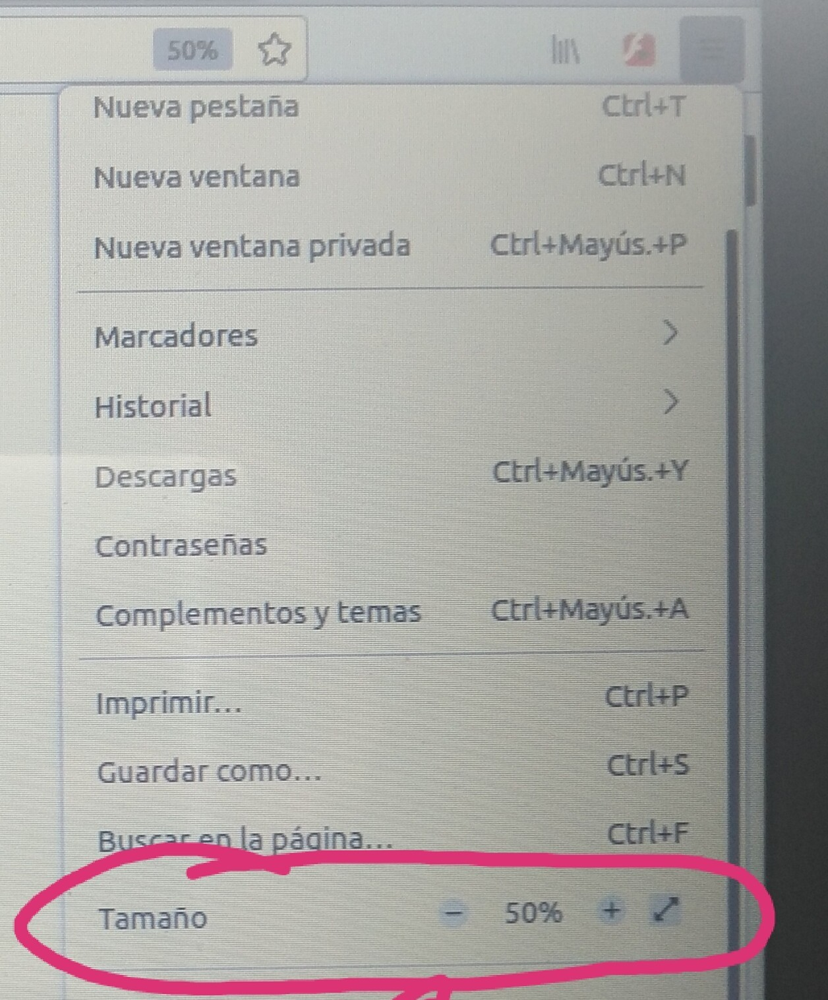
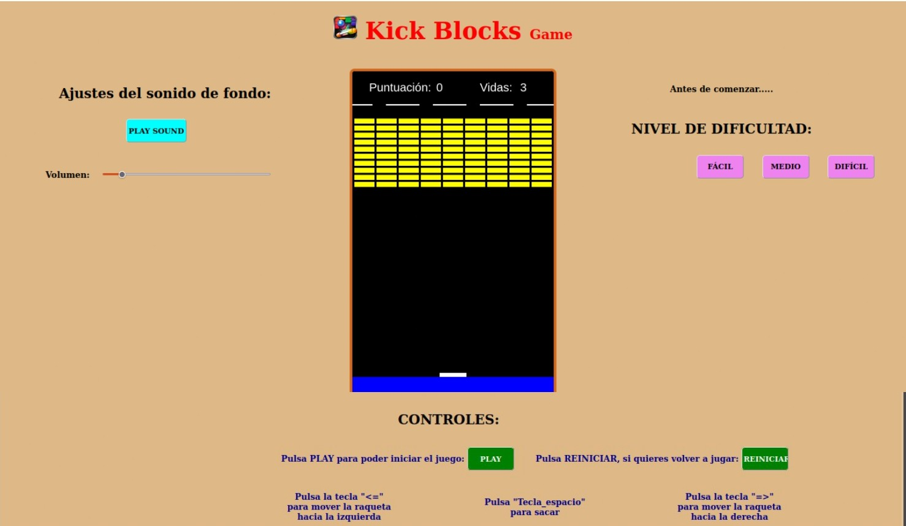
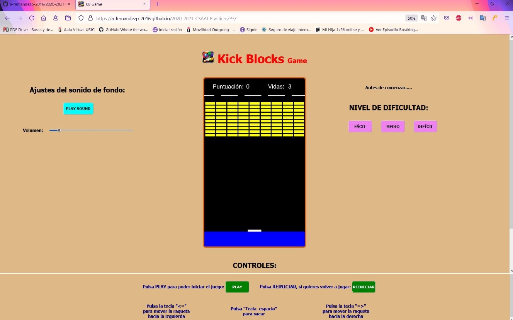
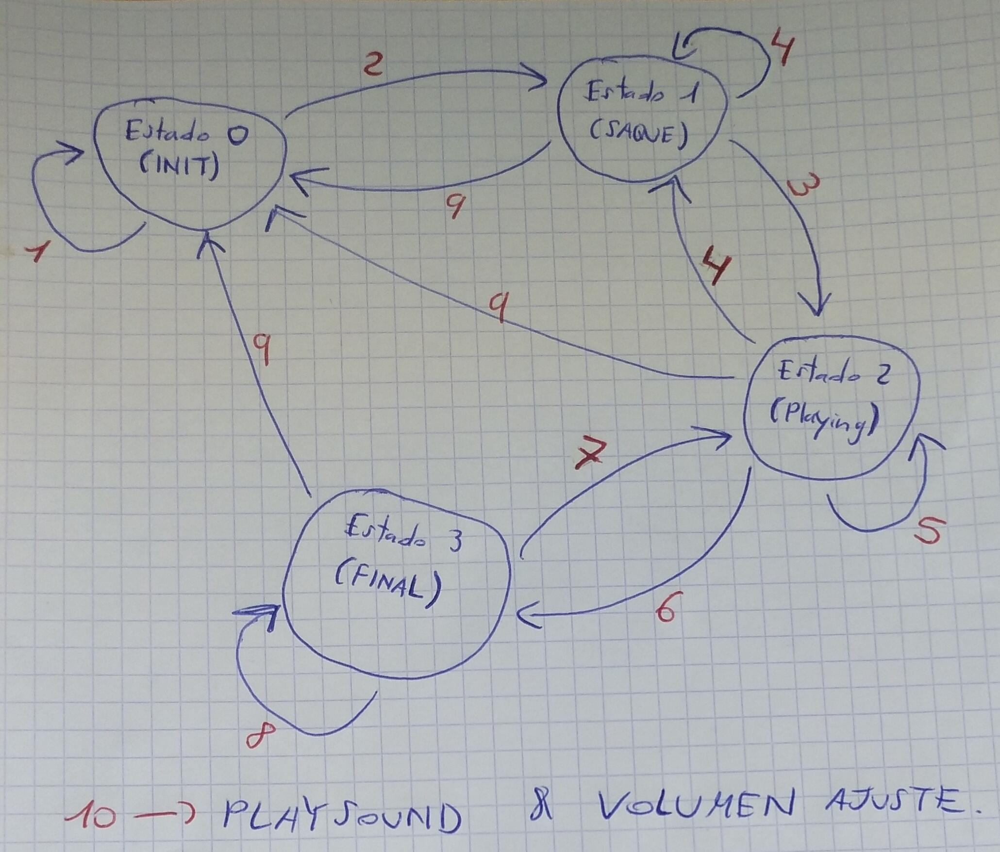
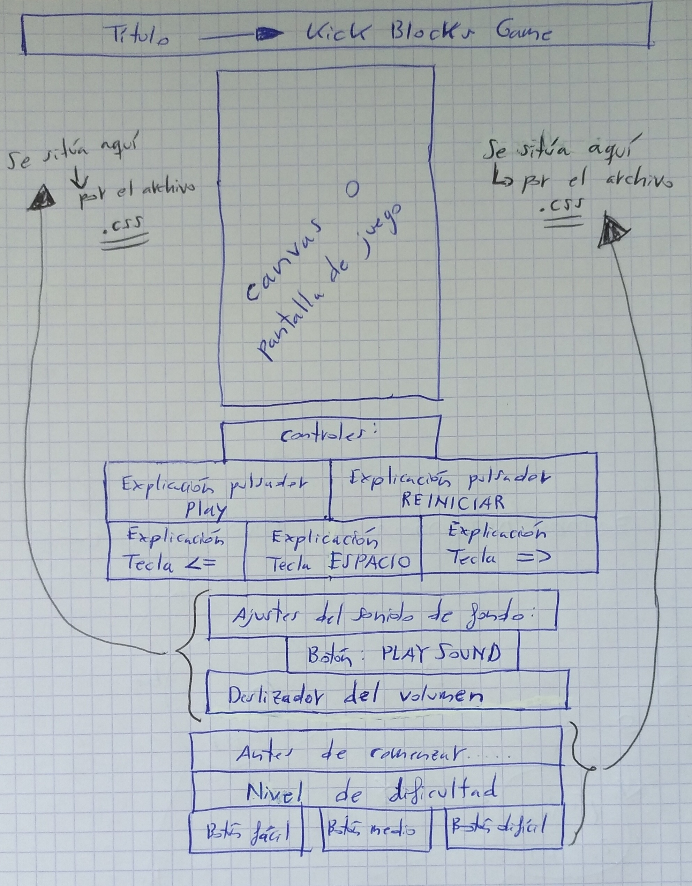
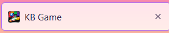
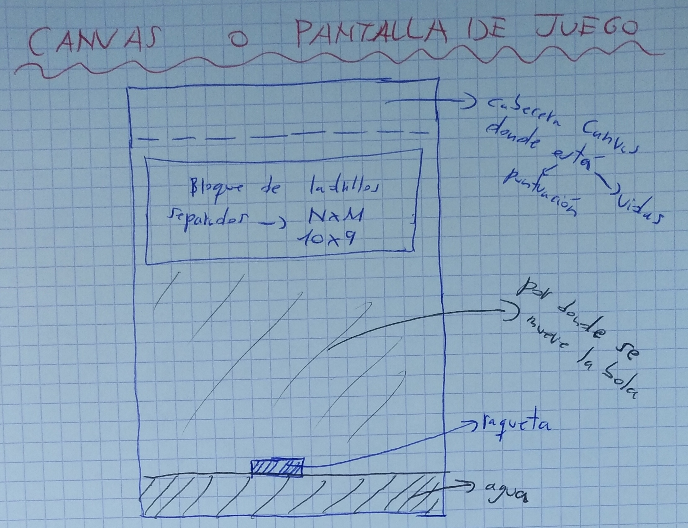
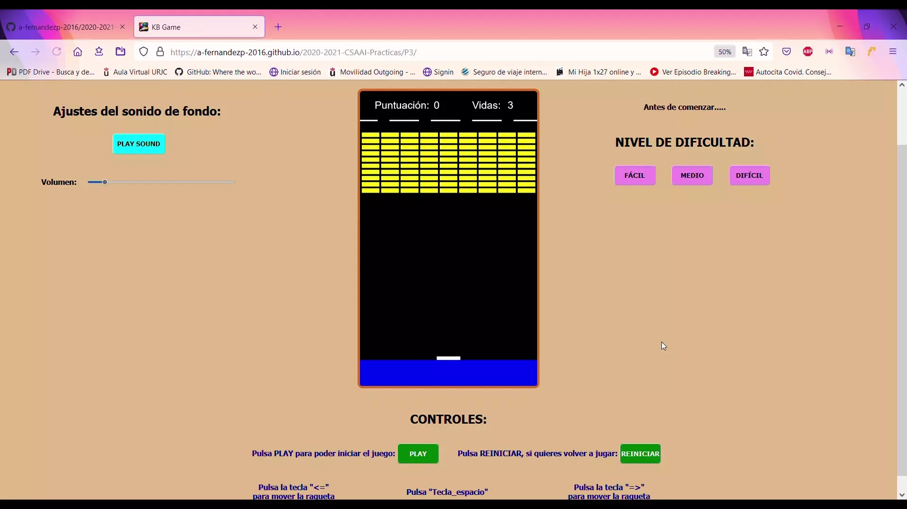

 # Práctica 3: Videojuego retro.

 ### **Especificaciones de la práctica.**
 

Cuando muestres el contenido de mi Práctica 3 en el Navegador, a través de su correspondiente URL, **debes poner la pantalla al 50% de ZOOM, para que se vea la pantalla del juego entera sin utilizar la rueda del ratón y, por tanto, que puedas jugar correctamente**.
  
  

Debes mostrarlo en el Navegador de Mozilla Firefox (qué es el navegador en que el autor de esta práctica ha trabajado) y, en el Sistema Operativo (S.O) de Windows 10. También, lo puedes mostrar en el S.O de Ubuntu-Linux, aunque el texto de la parte de controles y los botones de dificultad se desalinean, por lo que ya comenté en la P1 de los formatos de cada Navegador y de cada S.O que utiliza cada uno. Véase en una imagen:
  
En S.O Ubuntu-Linux y Navegador Mozilla Firefox:

En S.O Windows 10 y Navegador Mozilla Firefox:

No lo visualices en tu móvil o smartphone, ya que al ser la resolución de pantalla mucho menor, todos los textos se unirán y se verá mal y, aparte, no podrás jugar porque **es necesario un teclado de PC para jugar**.

### **Ahora pasamos a la explicación del videojuego retro:**

El desarrollo del videojuego se divide en dos partes:

    1. La parte Obligatoria.
    2. La parte de Mejoras.

 

### 1. LA PARTE OBLIGATORIA:

El juego consta de cuatro Etapas o Estados, que están explicadas gráficamente en la siguiente imagen:

Etapas o Estados:

    1) ESTADO 0 => INIT.
    2) ESTADO 1 => SAQUE.
    3) ESTADO 2 => PLAYING.
    4) ESTADO 3 => FINAL.

Explicación de los nº en rojo:

1. Para volver al Estado Inicial o permanecer en dicho estado, hay que darle a Reiniciar (volver a jugar desde el principio), o eligiendo un nivel de dificultad (esto sólo se puede hacer en el Estado Inicial y sólo se puede elegir 1. Una vez das a PLAY, ya no sirve pulsar un nivel de dificultad, a no ser que reinicies y vuelvas de nuevo al Estado Inicial).
2. Para pasar del Estado Init al de Saque, hay que pulsar el PLAY y, así, iniciar el juego/videojuego. Si no pulsas el PLAY, no podrás empezar a jugar.
3. Para pasar del Estado de Saque al de Playing, hay que pulsar la **tecla de saque**, que es el ESPACIO del teclado QWERTY de tu PC. Si no pulsas dicha tecla, la bola no sacará y no comenzará a moverse.
4. El juego vuelve de nuevo al Estado de Saque, cada vez que pierdas una vida, hasta que te queden 0 vidas.
5. El juego se mantendrá en el Estado Playing, mientras tengas vidas y al tener 0 vidas no te caigas al agua, o hasta que rompas todos los ladrillos amarillos. El Estado Playing es el Estado interactivo, donde el usuario podrá usar los controles que se explican debajo del Canvas o Pantalla de juego. Los controles del Estado Playing son: 
    1) Tecla <=.
    2) Tecla =>.

6. El juego pasará al Estado Final, cuando se llegue a la puntuación máxima (que es igual al nº de filas por el nº de columnas de ladrillos, ya que cada uno de ellos vale 1), o que la bola se caíga al agua, quedando 0 vidas. En el primer caso, sonará un sonido de victoria y, saldrá un mensaje de victoria. En el segundo caso, sonará un sonido de derrota y, saldrá un mensaje de derrota.
7. PROCESO NO VÁLIDO. El juego no puede volver del Estado Final al Estado Playing.
8. El juego se mantendrá en el Estado Final, es decir, con el mensaje de victoria o de derrota, hasta que se pulse la tecla REINICIAR para volver a optar a jugar de nuevo.
9. Siempre, independientemente del Estado en que estés, podrás pulsar a REINICIAR, para volver al Estado Inicial.
10. Independientemente del Estado en que estés, puedes pulsar PLAY SOUND, para volver a iniciar la canción/sonido de fondo y, ajustar el volumen al nivel sonoro que desees (ten en cuenta que si lo subes a un nivel medio-alto, puede que los sonidos del golpeo de la bola con las paredes y la raqueta, el sonido de los ladrillos rompiéndose, el sonido de saque inicial, el de victoria o el de derrota, no se escuchen porque se solapen). Darle a PLAY SOUND o ajustar el nivel sonoro con el deslizador del volumen, NO implica cambiar de Estado.

La estructura del código HTML (código y archivo principal) es la siguiente:

El código y archivo .CSS, es para dar estilo, colores, formato y formas a nuestro videojuego retro y página HTML.

El código y archivo .JS, es para llevar a cabo todas las acciones y movimientos del videojuego retro y, mostrarlos en la página HTML.

La cabecera o pestaña del Navegador Mozilla Firefox es la siguiente:

    1. Logo o icono del videojuego retro.
    2. Siglas del Título del videojuego retro: KB Game = Kick Blocks Game.

El Canvas o Pantalla de juego se estructura en las siguientes partes:

El código JS, se estructura en:

1. Líneas de código de interconexión con el archivo HTML.
2. Líneas de código de los datos, variables, ctes y Objetos Literales a usar en el videojuego retro.
3. Funciones que realizan tareas determinadas y son llamadas desde la función principal: UPDATE.
4. Funciones onclick para pulsar botones.
5. Función del botón deslizante para ajustar el volumen del sonido de fondo.
6. Punto de entrada a la función principal: UPDATE.

Sólo puedes modificar a tu gusto 3 variables del punto 3:

1) Variable **vidas**, para poner el nº máximo de vidas que desees.
2) Variable **velocidad de la bola en eje X** + variable **velocidad de la bola en eje Y**, para poner la velocidad de la bola a tu gusto.
3) Variable del nº de filas del bloque de ladrillos separados. Por defecto, 10 filas, aunque puedes poner entre [5,25].

#### - RESUMEN de la Parte Obligatoria:

1. Utilizando los programas de HTML, CSS Y JS, se ha realizado el videojuego retro: Kick Blocks Game 
(KB Game).
2. La raqueta se mueve con las flechas del teclado QWERTY: flecha derecha (=>) y flecha izquierda (<=).
3. Para sacar la bola, se utiliza la tecla del teclado QWERTY: ESPACIO (SPACE).
4. El botón del archivo principal HTML: PLAY, es para poder comenzar a jugar al videojuego retro.
5. Ángulo de rebote de la bola sobre la raqueta = cte = 45º.
6. Como mínimo debe haber 9 columnas y 5 filas. Es decir, 9 x 5 = 45 ladrillos separados entre sí.
7. Puntuación de cada ladrillo = 1.
8. Vidas por defecto = 3, pero si quiere, el usuario puede variarlo a su gusto.
9. Si la bola cae al agua, es decir, no se golpea con la raqueta, se pierde 1 vida.
10. En la cabecera del canvas se encuentra la **Puntuación que se va obteniendo** y las **Vidas que van quedando**.

 

### 2. LA PARTE DE MEJORAS:

Las **MEJORAS** que se han llevado a cabo, son las siguientes:

1. Se ha añadido un botón (PLAY SOUND) para activar el sonido o canción de fondo cuando se quiera. Si se acabara dicho sonido, se podría pulsar dicho botón y, se volvería a iniciar la canción de fondo. Aunque, si le damos a PLAY, se activa automáticamente el sonido o canción de fondo.
2. El botón deslizador para ajustar un nivel sonoro de volumen entre [0,1], a gusto del usuario. Recuerda que: si subes el volumen a un nivel medio-alto, puede que los sonidos del golpeo de la bola con las paredes y la raqueta, el sonido de los ladrillos rompiéndose, el sonido de saque inicial, el de victoria o el de derrota, no se escuchen porque se solapen.
3. Los 3 botones del nivel de dificultad: Fácil, Medio y Difícil. Sólo se pueden pulsar en la fase o estado 0/INIT, en otra cualquier fase será un proceso no válido, es decir, los botones están capados para ciertas circunstancias. Una de ellas, ya está explicada, las otras son, que si pulsas uno de los tres botones, volver a pulsar de nuevo 1 de los tres, será un proceso no válido. Y otra circunstancia, que por defecto (si no se pulsa ninguno de los 3 botones), se jugará en el nivel Fácil.
4. La incorporación del doble de filas (de 5 que pide el enunciado de la P3), a las que hay establecidas: 10 filas (5 x 2 = 10). Aunque, puedes poner un nº variable de filas, ya que está configurado para que pueda ser variable y, que no haya problemas en el videojuego.
5. La incorporación de diversos sonidos, entre los que destaca, el ya hablado sonido de fondo o principal. Los otros son:

    1) Sonido del rebote de la bola con la pared/raqueta.
    2) Sonido del saque inicial, o saque después de haber perdido una vida.
    3) Sonido de victoria, si se ha alcanzado la puntuación máxima de: nº de filas x nº de columnas.
    4) Sonido de derrota, si antes de alcanzar la puntuación máxima, el usuario se queda sin vidas y la bola cae al agua.
    5) Sonido de romper ladrillos, cada vez que la bola rompe un ladrillo amarillo del bloque NxM con separación entre sí.
    6) Sonido que representa la pérdida de 1 vida, cuando la bola cae al agua (o no se golpea la bola con la raqueta).

Hay que saber, que los niveles de dificultad se diferencian en la velocidad de la bola. A mayor dificultad, la bola va más rápido, respecto al nivel por defecto Fácil, que es quien tiene la velocidad por defecto de la variable en X e Y de la bola. Dicha variable si se multiplica por 1.4, sería la velocidad de la bola en el Nivel Medio. Y si se multiplica por 1.8, sería la velocidad de la bola en el Nivel Difícil. 

Por otro lado, en función subamos de nivel (de fácil a difícil), también se aumentará la velocidad de la raqueta (en eje x) de 10 en 10. Ten en cuenta, que al aumentar la velocidad de la raqueta, dicha raqueta puede llegar hasta un poco más de las paredes verticales, pero sin llegar a desaparecer (que esto es lo importante), ya que la raqueta está capada, o mejor dicho, no puede salirse más allá de las paredes laterales del canvas o pantalla de juego.

 

Y, esto es todo el programa del videojuego retro: KICK BLOCKS Game, en HTML, CSS y JS. Espero que la valoración que se haga sea buena, o incluso, muy buena. Es un trabajo con bastante esfuerzo, sacrificio y horas.
 
 
Muchas gracias por su tiempo y atención.

Atentamente.

El autor del programa: **KICK BLOCKS Game** =es> **Alejandro Fernández Pérez**, alumno de GISAM (URJC).

 
 

Archivo .webp (lo que se conoce como GIF):

