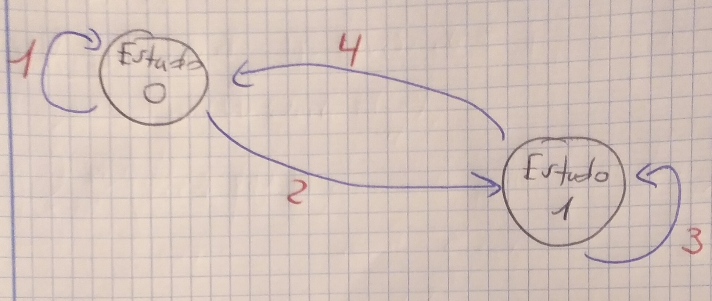
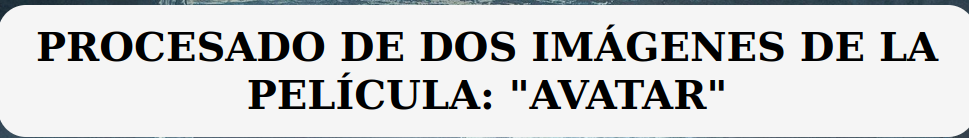
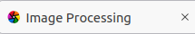

 # Práctica 4: Procesado de imagen.

### **Especificaciones de la práctica.**
 

Si queremos manipular imágenes con **getImageData()**, como se puede usar para provocar ataques XSS, hay que trabajar en **local**, con un **Servidor Web propio**. Para ello, ejecutamos en nuestro terminal de Ubuntu-Linux, lo siguiente: **python3 -m http.server**. Es decir, para mostrar la P4 en el Navegador, hay que usar el terminal de Ubuntu-Linux y el comando cd para lanzar el servidor como local desde donde tengamos los programas de HTML, CSS y JS de la P4. La URL que nos salga, la copiamos en el Navegador de Mozilla Firefox de Ubuntu-Linux, para poder mostrar la práctica 4 sin problemas de seguridad. La URL es la siguiente: **http://0.0.0.0:8000/index.html**.

Aunque también, se puede mostrar la P4 en el navegador de Mozilla Firefox, a través del siguiente link:
**https://a-fernandezp-2016.github.io/2020-2021-CSAAI-Practicas/P4/**

Por otro lado, como ya se ha podido apreciar, el Sistema Operativo - S.O que se debe usar es: **Ubuntu-Linux**. Y el Navegador: **Mozilla Firefox**. El zoom del Navegador para mostrar el tamaño de pantalla, se deja al 100%, que es el estándar, el que viene por defecto.
 
 

### **La parte obligatoria se compone de lo siguiente:**

 

1) La imagen 1 de la izquierda: **Avatar1.jpg**. Ya que como mínimo tiene que haber una imagen inicial.
2) A través de dos filtros (elegimos uno), se generará la imagen manipulada de la imagen inicial.
3) Los filtros son: 1) **Filtro de conversión a escala de grises**. 2) **Filtro de conversión a RGB por medio de 3 deslizadores: R = Red, G = Green y B = Blue (umbrales)**.
4) Cada filtro tiene su botón. 
5) Los umbrales de los deslizadores RGB van de 0 a 255. Siendo R=0, G=0 y B=0 => el color negro. Lo opuesto es lo contrario.
6) En el filtro de escala de grises, no funcionan los deslizadores, ya que no hay, ni tampoco hay canales, en ese tipo de filtro.
7) Es importante saber, que tanto el filtro de grises, como el de color, se aplican a la imagen original y, no a la imagen resultado de otro filtro.
 

El único problema surgido es, que al pulsar el botón **en RGB** y que aparezcan los deslizadores de R, G y B, para así poder ajustar los valores RGB a gusto del usuario, resulta que, si vas reduciendo uno, dos o todos los deslizadores desde 255 (el máx) a 0 (el min), funciona bien, se elimina el color primario RGB que reduces. Pero luego, cuando ya estás en 0 y, quieres aumentar hacia 255, no sé que pasa, que no detecta el cambio y se queda igual. La verdad, no entiendo por qué. He buscado por internet (en guías de HTML y JS, en vídeos de YouTube, en blogs, en PDFs y por otras páginas web), he pedido ayuda a compañeros para ver si se resolvía este único problema que me pasa, he comparado con sus prácticas y nada, se sigue *boogueando*. Horas y horas de búsqueda, de prueba - error y, éste ha sido el resultado final. Espero que se tenga en cuenta. Todo lo demás, PERFECTO.
 

### **La parte de mejoras se compone de lo siguiente:**

 

En esta práctica, se ha añadido otra imagen más (la imagen 2), aparte de la imagen 1, para que haya interactividad y el usuario tenga para elegir.

Debes elegir una: la imagen A o la B. Si eliges la A y luego pulsas para elegir la B, no te dejará ya que habrás pasado al siguiente estado y para volver al inicial, tienes que dar al botón de la casa para borrar la imagen manipulada elegida y así poder elegir otra.

Diagrama de estados:

Cuando, a través del Navegador, nos muestre la P4, veremos: el título, dos imágenes a elegir: A y B, dos botones correspondientes a la imagen A y a la B respectivamente, a continuación, la imagen a manipular elegida (A o B), luego, los ajustes de la manipulación, a elegir entre filtro de escala de grises o filtro RGB por umbrales y, con opción de pulsar el botón "CASA" para volver al estado inicial y elegir de nuevo entre A o B. Por último, elegimos entre los dos últimos filtros: el de volteo 180º y el de la imagen especular (muestra como un espejo).

Cada nº en rojo corresponde a lo siguiente:

1. Si al visualizar por primera vez la P4 en el Navegador, no pulsamos el botón de "Imagen A" o "Imagen B", seguiremos y nos mantendremos en el Estado Inicial. Por tanto, no aparecerá nada en la imagen a manipulada y, si pulsamos cualquier otro botón, será un proceso INVÁLIDO.
2. Pasamos del Estado Inicial al Estado Manipulate (para manipular imágenes). Aquí ya podemos pulsar los botónes de: 
    **Casa** = volver al Estado Inicial y elegir de nuevo imagen a manipular. 
    **En Gray Scale** = para transformar o convertir la imagen a escala de grises. 
    **EN RGB** = para transformar o convertir la imagen a RGB, donde aparecerán 3 deslizadores para cada uno de los 3 canales R, G y B, que el usuario podrá mover e interactuar con él. 
    **Imagen volteada 180º** = para girar la imagen en escala de grises o en RGB, volteándola 180º. Si pulsas 1 vez, se girará la imagen 180º y, si pulsas otra vez, se girará otros 180º respecto a sus 180º ya girados, es decir, 180 + 180 = 360º. O sea, que vuelve a su estado inicial. Si quieres seguir pulsando, pasaría lo mismo sucesivamente. 
    **Imagen especular** = para girar la imagen en escala de grises o en RGB, respecto a su eje horizontal. Es decir, al pulsar en dicho botón, se verá la imagen pero como lo verías en un espejo. Si pulsas otra vez, se verá de nuevo normal. Si quieres seguir pulsando, pasaría lo mismo sucesivamente. 
    ---NOTA: Recuerda que si pulsas en escala de grises, se hace la transformación desde la imagen elegida inicial, la que no tiene filtros todavía. Y si pulsas en RGB, también se hace desde la imagen elegida inicial, la que no tiene filtros todavía. Es decir, al pulsar en uno de los dos, se reinicia la imagen elegida.
3. Para seguir manipulando la imagen elegida, a través de los botones descritos en el anterior punto.
4. Para volver al Estado Inicial a elegir de nuevo una imagen a manipular, entre la A o la B. Sólo se puede hacer a través del botón: CASA.

 

O sea, para resumir:

Las mejoras son las siguientes:

1. Se ha añadido una imagen de más.
2. Se ha añadido el botón CASA, para volver a elegir imagen a manipular.
3. Se han añadido dos filtros más, aparte del de escala de grises y del de colorm RGB: 1) El filtro de volteo 180º y 2) el filtro de imagen especular.
4. La P4 está diseñada en un fondo de imagen editado en Adobe Photoshop, bastante trabajado, por medio de My Apps URJC.

Imagen de fondo:

5. El título tiene los estilos configurados en CSS, para que se vea perfectamente (visualmente hablando).

6. La pestaña de la página HTML de Image Processing, con su icono multicolor:

 

Y, esto es todo el programa del procesado de imagen: Image Processing, en HTML, CSS y JS. Espero que la valoración que se haga sea buena, o incluso, muy buena. Es un trabajo con bastante esfuerzo, sacrificio y horas.

Muchas gracias por su tiempo y atención.

Atentamente.

El autor del programa: **Image Processing** =es> **Alejandro Fernández Pérez**, alumno de GISAM (URJC).