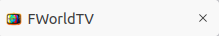
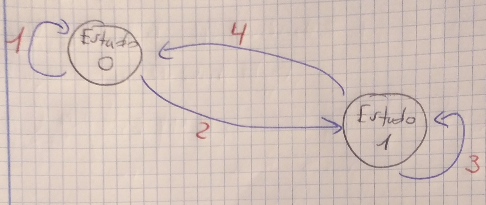
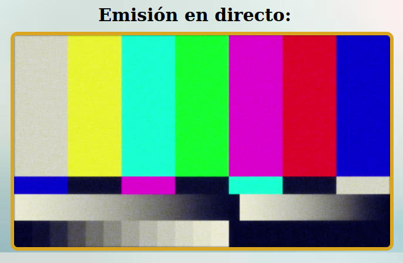
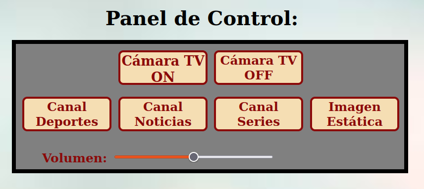
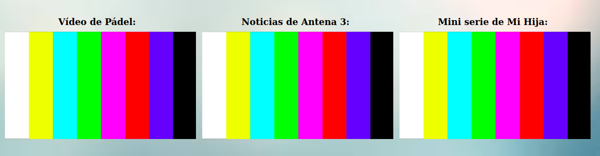

 # Práctica 5: Realizador de TV.

### **Especificaciones de la práctica.**
 

Para mostrar la P5 en el Navegador, lo tenemos que llevar a cabo en el Sistema Operativo - S.O de **Ubuntu-Linux** y, en el Navegador de **Mozilla Firefox**. El zoom del Navegador para mostrar el tamaño de pantalla, se deja al 100%, que es el estándar, el que viene por defecto. Para acceder, se hace a través del siguiente link: **https://a-fernandezp-2016.github.io/2020-2021-CSAAI-Practicas/P5/**.

 

El diseño del icono del título del cuerpo y de la pestaña de la Pág HTML, se ha diseñado y realizado a través del programa **Adobe Photoshop 2018** de **My APPs URJC**. Bastante trabajado, la verdad. 

A continuación, veréis las imágenes de ambos iconos:

Cabecera/Pestaña pág HTML:

Icono del título en el body:

El estilo de la P5 se lleva a cabo con CSS. El programa principal es HTML. Y las acciones de programación del programa de la P5 es con JavaScript.

A continuación, verás el vídeo en emisión (en apagado). Si quieres que cambie, debes pulsar a Cámara TV ON. Si pulsas otro botón será inválido por la regla de **Diagrama de Estados**.

Diagrama de Estados:

Cada nº en rojo significa lo siguiente:

1. El usuario se mantiene en el Estado Inicial (0), 1) porque todavía no le ha dado al botón de Cámara TV ON. O, 2) porque el usuario le ha dado a Cámara TV OFF, es decir, ha vuelto al Estado Inicial (0) y no ha apretado el botón de Cámara TV ON de nuevo, por eso se mantiene.
2. Vamos al Estado de Emisión (1), al apretar el botón de: Cámara TV ON.
3. El usuario se mantiene en el Estado de Emisión (1), al apretar el botón de: Canal Deportes, Canal Noticias, Canal Series o Imagen estática.
4. Finalmente, vamos al Estado Inicial (0) de nuevo, porque el usuario le ha dado a Cámara TV OFF.

Vídeo de emisión en directo apagado:

El panel de control, desde donde el realizador (o usuario) controla los vídeos, se ha realizado en forma de tabla con 2 filas y 4 columnas, la 1º fila para los botones de: Cámara TV ON y Cámara TV OFF y, la 2º fila para los botones de: Canal Deportes, Canal Noticias, Canal Series e Imagen estática.

Cuando se pulsa el botón de Imagen estática, dicha imagen se situará en el vídeo en directo y en los otros tres vídeos en segundo plano.

Cuando se pulsa el botón de Cámara TV OFF, dicha imagen de barras verticales multicolores, se situará en el vídeo en directo y en los otros tres vídeos en segundo plano.

Cuando se pulsa el botón de Cámara TV ON, en el vídeo en directo se situará la Imagen estática y, en el resto de vídeos en segundo plano se situará el vídeo propio de cada uno de ellos, muteado.

Cuando se pulsa un botón de los tres vídeos, en función del botón que hayas pulsado, se sitúa el contenido de dicho botón pulsado en el vídeo en directo. Los otros dos vídeos siguen en segundo plano y, muteados.

Imagen del Panel de Control del Realizador:

Imagen de los tres vídeos en segundo plano, sin sonido y apagados:

 

### **Las Mejoras son las siguientes:**

1. Se ha procedido a la reproducción en bucle, en el que, al seleccionar una fuente, ésta se reproduce sólo durante 2 segundos y, se vuelve atrás (2 segundos), repitiéndose dicho trozo de dos segundos en bucle, constantemente. Se puede cambiar la fuente de vídeo ya que el bucle está puesto como **loop** en la etiqueta de vídeo de HTML y da igual el link que tenga la fuente, el bucle funcionará siempre.

2. Se ha añadido un vídeo de más. En las especificaciones obligatorias te decía de hacerlo con dos vídeos (sin contar con el vídeo en directo) como mínimo. Todo los vídeos que se añadan, son **mejoras**.

3. En vez de utilizar los vídeos que nos da el profesor Juan, yo he hecho como si fuera un canal de TV, con canal de noticias, de deportes y canal de series. Aparte está, la Imagen estática, que es como darle una pausa a la realización y, la imagen de las barras verticales multicolores, que aparecen cuando se apaga la cámara de TV.

4. Se ha añadido un volumen en forma de deslizador en el panel de control del realizador, cuyo fin es aumentar o disminuir el volumen a gusto del usuario y, cuando se emita uno de los tres vídeos que están en segundo plano. El deslizador del volumen va de 0 a 1, incrementándose de 0.1 en 0.1, siendo 0 = nivel sonoro mínimo de volumen y, 1 = nivel sonoro máximo de volumen.

 

### **CONCLUSIÓN:**

Y, esto es todo el programa del Realizador de TV: Férez World TV, en HTML, CSS y JS. Espero que la valoración que se haga sea buena, o incluso, muy buena. Es un trabajo con bastante esfuerzo, sacrificio y horas.
 
 
Muchas gracias por su tiempo y atención.

Atentamente.

El autor del programa: **Férez World TV** =es> **Alejandro Fernández Pérez**, alumno de GISAM (URJC).

 
 

## **NOTA:**

Ésta es la imagen estática, que aparece al inicio cuando se aprieta el botón de Cámara TV ON. La frase de debajo en color granate: *Visualiza todo en 4K*, no quiere decir que el vídeo o los vídeos en segundo plano se visualicen en 4K, sino que es una frase metafórica, refiriéndose a que Férez World TV (el canal de TV) comparte dicha filosofía o frase metafórica, que significa, que lo importante en la vida es pararse, alejarse y, observar la situación desde una perspectiva más amplia (de ahí 4K, que es muy grande o amplio). La frase siguiente resume la frase de la Imagen estática estrictamente bien: **Tiene mejor conocimiento del mundo, no el que más ha vivido, sino el que más ha observado**.