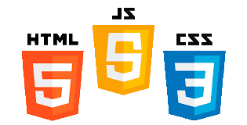

# 2020-2021-CSAAI-Practicas

### Página Principal de Mis Prácticas de CSAAI.  

 
 

Mis prácticas de la asignatura Construcción de Servicios y Aplicaciones Audiovisuales en Internet Curso 2020-2021
 
 
Aquí comienzan mis proyectos de las prácticas de CSAAI (Construcción de Servicios y Aplicaciones Audiovisuales en Internet).
 
 

 
 
### Son 5 prácticas en total: P1, P2, P3, P4 Y P5.
 
 
P1 => CV de un personaje ficticio. En mi caso, Peeta Mellark.
 
 
P2 => Calculadora Huawei Web.
 
 
P3 => Videojuego Retro.
 
 
P4 => Procesado de imagen.
 
 
P5 => Vídeo.
 
 
¡QUE COMIENCE LA PROGRAMACIÓN WEB DEL LADO DEL CLIENTE!
 
 
....¡Y que HTML, CSS Y JS os acompañen!

 
 