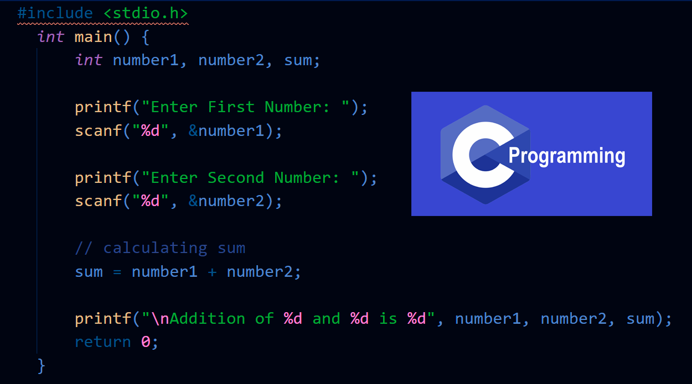
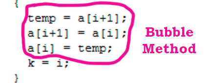
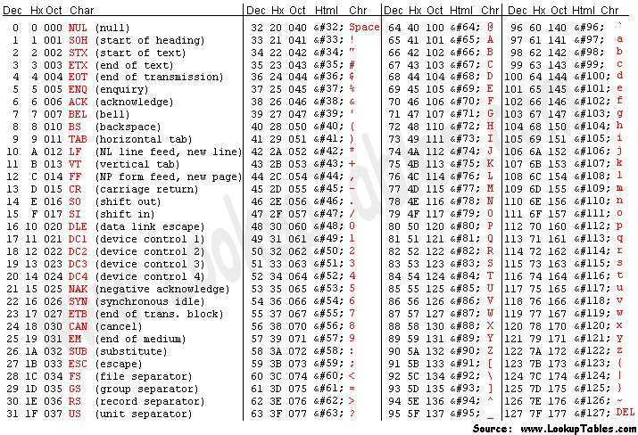

# FUNDAMENTALS IN PROGRAMMING

 

By CodeBlocks

 

### 1. INTRODUCTION TO C PROGRAMMING

This course, we are going to learn about C programming. So, we are going to pull up to our GitHub some practical exercises for our improvement, our skills and our knowledge. I hope that it is a great subject. Learn is always good.

### 2. PRACTICAL EXERCISES
 

### - Exercises 1:
    
1. Hello World (**done**) => its own C code is in the folder 1HelloWorld > 1HelloWorld.
2. Print Integer (**done**) => its own C code is in the folder 1HelloWorld > 2Print_Integer.
3. Print Three Integers (**done**) => its own C code is in the folder 1HelloWorld > 3Print_Three_Integers.
4. Read Integer (**done**) => its own C code is in the folder 1HelloWorld > 4Read_Integer.
5. Read Two Integers (**done**) => its own C code is in the folder 1HelloWorld > 5Read_Two_Integers.
6. Your Year (**done**) => its own C code is in the folder 1HelloWorld > 6Your_Year.
7. Other Years (**done**) => its own C code is in the folder 1HelloWorld > 7Other_Years.
8. Swap Digits (**done**) => its own C code is in the folder 1HelloWorld > 8Swap_Digits => 
9. Complex numbers (**done**) => its own C code is in the folder 1HelloWorld > 9Complex_numbers.
10. Photo Store (**done**) => its own C code is in the folder 1HelloWorld > 10Photo_Store => 
11. Food for a cat (**done**) => its own C code is in the folder 1HelloWorld > 11Food_for_cat => 
- The statement of the Exercise 1 is in the folder 1HelloWorld > PDF(Excercises1 - Hello World).

### - Exercises 2:
    
1. Practice 2.1 (**done**) => its own C code is in the folder 2DataTypes_Conversions > 1EnterDisplayInt.
2. Practice 2.2 (**done**) => its own C code is in the folder 2DataTypes_Conversions > 2EnterDisplayFloat.
3. Practice 2.3 (**done**) => its own C code is in the folder 2DataTypes_Conversions > 3DivideDisplay2int.
4. Practice 2.4 (**done**) => its own C code is in the folder 2DataTypes_Conversions > 4Divide2intDisplayFloat.
5. Practice 2.5 (**done**) => its own C code is in the folder 2DataTypes_Conversions > 5Divide2intConvertToFloatDisplay.
6. Practice 2.6 (**done**) => its own C code is in the folder 2DataTypes_Conversions > 6EnterFloatDisplayInt.
7. Practice 2.7 (**done**) => its own C code is in the folder 2DataTypes_Conversions > 7EnterDisplayChar.
8. Practice 2.8 (**done**) => its own C code is in the folder 2DataTypes_Conversions > 8EnterCharDisplayASCIIvalue.
9. Practice 2.9 (**done**) => its own C code is in the folder 2DataTypes_Conversions > 9RepresentationInDifferentWays.
10. Practice 2.10 (**done**) => its own C code is in the folder 2DataTypes_Conversions > 10DisplaySizesOfVariables.
11. Practice 2.11 (**done**) => its own C code is in the folder 2DataTypes_Conversions > 11QuantityOfArtificialFertilizer.
12. Practice 2.12 (**done**) => its own C code is in the folder 2DataTypes_Conversions > 12ConversionOfTime.
13. Practice 2.13 (**done**) => its own C code is in the folder 2DataTypes_Conversions > 13IntegerAndDecimalParts.
14. Practice 2.14 (**done**) => its own C code is in the folder 2DataTypes_Conversions > 14Subtract32inASCII.
15. Practice 2.15 (**done**) => its own C code is in the folder 2DataTypes_Conversions > 15DisplayNextCharOfASCII.
16. Practice 2.16 (**done**) => its own C code is in the folder 2DataTypes_Conversions > 16TimeOfFlightForaMultirotor.
- The statement of the Exercise 2 is in the folder 2DataTypes_Conversions > PDF(Excercises2 - Data types in C and conversions).

- Important image about the ASCII Table => 

### - Exercises 3:
    
1. Practice 3.1 (**done**) => its own C code is in the folder 3Arithmetic_Operators > 1AreaCircle.
2. Practice 3.2 (**done**) => its own C code is in the folder 3Arithmetic_Operators > 2CarConsumption.
3. Practice 3.3 (**done**) => its own C code is in the folder 3Arithmetic_Operators > 3Hypotenuse.
4. Practice 3.4 (**done**) => its own C code is in the folder 3Arithmetic_Operators > 4AreaOfTriangle.
5. Practice 3.5 (**done**) => its own C code is in the folder 3Arithmetic_Operators > 5CurrencyConverter.
6. Practice 3.6 (**done**) => its own C code is in the folder 3Arithmetic_Operators > 6AnumberTOthreeVariables.
7. Practice 3.7 (**done**) => its own C code is in the folder 3Arithmetic_Operators > 7Temperature.
8. Practice 3.8 (**done**) => its own C code is in the folder 3Arithmetic_Operators > 8SecTOhours_min_sec.
9. Practice 3.9 (**done**) => its own C code is in the folder 3Arithmetic_Operators > 9cmTOfeetANDinches.
- The statement of the Exercise 3 is in the folder 3Arithmetic_Operators > PDF(Excercises3 - Arithmetic operators).

### - Exercises 4:
    
1. Practice 4.1 (**done**) => its own C code is in the folder 4Conditions > 1AbsoluteValue.
2. Practice 4.2 (**done**) => its own C code is in the folder 4Conditions > 2TypeOfCharacter.
3. Practice 4.3 (**done**) => its own C code is in the folder 4Conditions > 3TypeOfYear.
4. Practice 4.4 (**done**) => its own C code is in the folder 4Conditions > 4PositiveORnegativeEQUATION.
5. Practice 4.5 (**done**) => its own C code is in the folder 4Conditions > 5QuadraticEquation.
6. Practice 4.6 (**done**) => its own C code is in the folder 4Conditions > 6Divisibility.
7. Practice 4.7 (**done**) => its own C code is in the folder 4Conditions > 7TheGradeOfaStudent.
8. Practice 4.8 (**done**) => its own C code is in the folder 4Conditions > 8LowestToHighestNUMS.
- The statement of the Exercise 4 is in the folder 4Conditions > PDF(Excercises4 - Logical and relational operators, Conditions).

### - Exercises 5:
    
1. Practice 5.1 (**done**) => its own C code is in the folder 5Loops > 1PrintTheMonth.
2. Practice 5.2 (**done**) => its own C code is in the folder 5Loops > 2Calculator.
3. Practice 5.3 (**done**) => its own C code is in the folder 5Loops > 3PrintAllNumbersFrom1toN.
4. Practice 5.4 (**done**) => its own C code is in the folder 5Loops > 4PrintAllNumbersFrom1toN_divisibleBy3.
5. Practice 5.5 (**done**) => its own C code is in the folder 5Loops > 5AddsUpFrom1toN.
6. Practice 5.6 (**done**) => its own C code is in the folder 5Loops > 6FactorialOfN.
7. Practice 5.7 (**done**) => its own C code is in the folder 5Loops > 7((ABC)%(AC) == 0).
8. Practice 5.8 (**done**) => its own C code is in the folder 5Loops > 8GCDandLCD.
9. Practice 5.9 (**done**) => its own C code is in the folder 5Loops > 9PrintAllNumbersFrom1toN_divisibleBy17.
10. Practice 5.10 (**done**) => its own C code is in the folder 5Loops > 10DecimalTObinary.
11. Practice 5.11 (**done**) => its own C code is in the folder 5Loops > 11MenuOf3TypesOfTriangles.
12. Practice 5.12 (**done**) => its own C code is in the folder 5Loops > 12FibonacciSequence.
13. Practice 5.13 (**done**) => its own C code is in the folder 5Loops > 13MakingDiamondsWith1num.
14. Practice 5.14 (**done**) => its own C code is in the folder 5Loops > 14MultiplicationTableLoop.
15. Practice 5.15 (**done**) => its own C code is in the folder 5Loops > 15SpecificCalendarLoop.
- The statement of the Exercise 5 is in the folder 5Loops > PDF(Excercises5 - Loops).

### - Exercises 6:
    
1. Practice 6.1 (**done**) => its own C code is in the folder 6Arrays > 1MenuArrays.
- The statement of the Exercise 6 is in the folder 6Arrays > PDF(Excercises6 - Arrays).

### - Exercises 7:
    
1. Practice 7.1 (**done**) => its own C code is in the folder 7Strings > 1BackwardsWord.
2. Practice 7.2 (**done**) => its own C code is in the folder 7Strings > 2PalindromeWord.
3. Practice 7.3 (**done**) => its own C code is in the folder 7Strings > 3HowManyNumbersInOneString.
4. Practice 7.4 (**done**) => its own C code is in the folder 7Strings > 4SecondWordInTheFirstWord.
5. Practice 7.5 (**done**) => its own C code is in the folder 7Strings > 5Concatenates2Words.
6. Practice 7.6 (**done**) => its own C code is in the folder 7Strings > 6HowManyTimesDoesTheLetterAppear.
7. Practice 7.7 (**done**) => its own C code is in the folder 7Strings > 7_5eurosTOfiveeuros.
- The statement of the Exercise 7 is in the folder 7Strings > PDF(Excercises7 - Strings).

### - Exercises 8:
    
1. Practice 8.1 (**done**) => its own C code is in the folder 8Functions > 1MenuWithFunctions.
- The statement of the Exercise 8 is in the folder 8Functions > PDF(Excercises8 - Functions and procedures).

### - Exercises 9:
    
1. Practice 9.1 (**done**) => its own C code is in the folder 9Structs > 1FinalProgramWithStructs.
- The statement of the Exercise 9 is in the folder 9Structs > PDF(Excercises9 - Composite data types).

 

### - Final Exam of Fundamentals in Programming of the FTN in the University of Novi Sad, according to the folder Final_Exam:
    1. The statement of World Cup Programming Exam, in PDF.
    2. The files to compile and execute the C Program.

 

PS: The photos are editted by Adobe Photoshop.